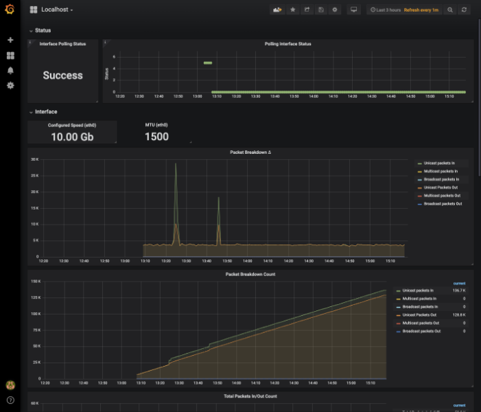
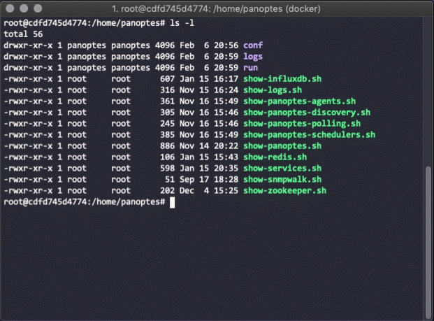
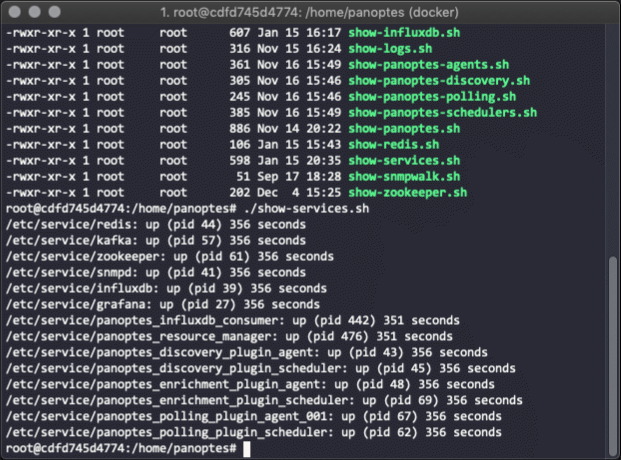
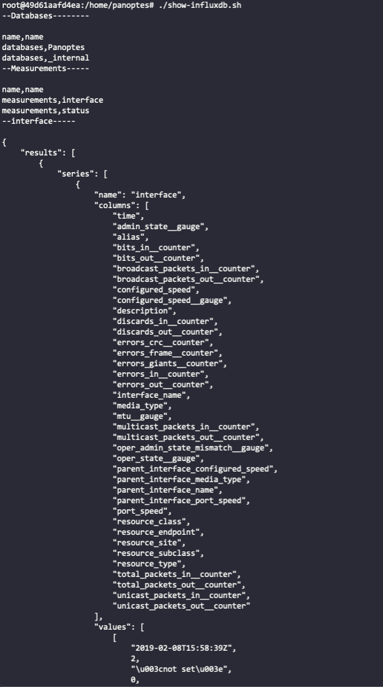

# Panoptes in Docker

> A Docker container for testing and observing Panoptes Functionality.

Panoptes is a Python based network telemetry ecosystem that implements discovery, enrichment and polling. To learn more 
about Panoptes, check out the project's [GitHub repository](https://github.com/yahoo/panoptes/). This repository 
provides a workbench version of Panoptes inside a Docker container that is intended to be used for testing concepts and 
observing code operations.

This does **not** follow best practices for deployment and shouldn't be used for production deployment. It's a very 
quick and dirty method to get a Panoptes instance up and running in a minimal amount of time with plenty of redundancy 
in place to allow enterprise scaling. While this isn't an efficient deployment, it does provide an accurate and 
operational build of the larger structure.

## Quick Reference
If you're impatient, and simply want to get this up and running, check out the [quickstart guide](docker_quickstart.md).

**Where to Get Help**

[](https://panoptescommunity.slack.com/open)

**Where to file Issues**

[Issues related to Panoptes_docker](https://github.com/yahoo/panoptes_docker/issues)

[Issues with Panoptes](https://github.com/yahoo/panoptes/issues)

**Image Updates**

[panoptes_docker PRs](https://github.com/yahoo/panoptes_docker/pulls)

**Source of this Description**

[The panoptes_docker Readme](https://github.com/yahoo/panoptes_docker/blob/master/Readme.md)

**Maintained by**

James Diss: rexfury@verizonmedia.com

**Supported Docker Versions**

Tested on [18.09.1](https://github.com/docker/docker-ce/releases/tag/v18.09.1)

## Table of Contents

- [Background](#background)
- [Install](#install-and-setup)
- [Usage](#usage)
- [Configuration](#configuration)
- [Contribute](#contribute)
- [Additional Resources](#additional-resources)
- [License](#license)


## Background

Panoptes is typically run in a distributed system, but it can be difficult to set up a working hive of the various 
moving parts. Panoptes can be horizontally scaled for metric collection by adding more capacity to run collection, this 
docker image simply cuts the total number of nodes down to *1*. This version also runs from a json file, but we use a 
command database internally and are working to extend this to CSV files.

The following image provides a visual representation of the services running inside this container.


This container is based on Ubuntu:18.04, and includes Python2.7, open-jdk 8, redis, zookeeper, and influxdb. There are 
also a few tools that are included for testing purposes, but are not necessary for operation of Panoptes:

- Netcat - Used to check functionality of the services
- tar - Used to view log archives.
- snmpd - Provides an easy target to poll
- nano - Makes it easier to open and modify configuration files and scripts.
- daemontools - Handles output and schedules the various subcomponents of Panoptes. Panoptes typically relies on its 
granular logging system to redirect to logging servers, but daemontools solves this requirement here.
- Grafana - Included as a visualization tool. See [the section on Grafana](#visualize-with-grafana) for details.

The container also installs a specific version of Kafka, because of a hard dependency.  This is accomplished by 
downloading and building the proper version from [the ASF archives](https://archive.apache.org/dist/kafka/). 

The configuration files for the services included in this image are available to browse under the `resources/` directory 
structure. Of particular interest will be the `resources/daemontools/panoptes_*.run` files, as these are the calls to 
the various Panoptes components.

## Install and Setup
First, you will need to have docker [installed on your machine](https://docs.docker.com/install/).

Then, You can either run [the pre-built image we've provided on Docker Hub](https://hub.docker.com/r/panoptes/panoptes_docker), 
or Build the image yourself from the [source code](https://github.com/yahoo/panoptes_docker).


To use the pre-built image from Docker Hub, simply pull it with `docker pull`:

```
docker pull panoptes/panoptes_docker
```

To build the image from scratch, first clone the repository and run `docker build` from inside the directory

```
git clone https://github.com/yahoo/panoptes_docker.git && cd panoptes_docker
docker build . -t panoptes_docker
```

### Usage

This container requires quite a lot of processing power since it contains a distributed system that has been packed into 
a small container. Because of this, you should consider limiting the resources available to the container.

The following command will run panoptes_docker inside a container:

```
docker run -d \
    --sysctl net.core.somaxconn=511 \
    --name="panoptes_docker" \
    --shm-size=2G \
    -p 127.0.0.1:8080:3000/tcp \
    panoptes_docker
```

There is a five minute delay until the first metrics will show up.

### Visualize with Grafana

After launching the panoptes_docker container, you should be able to point a browser at http://127.0.0.1:8080 and see 
the Grafana instance.

Use the auth pair `admin/admin` to get in, and don't worry about a new password, it won't last longer than the 
container.  Just skip it.

The datasource and dashboard should be available immediately, however, metrics gathering is delayed by 5 minutes. Your 
dashboard should look a little like this:



Note that any changes you make to the dashboard won't survive the death of the container. If you want to learn more 
about Grafana, [check out the docs on getting started](http://docs.grafana.org/guides/getting_started/).

### Examine the Image

Use `docker exec` to access the container for examination. 

```
docker exec -it panoptes_docker bash
```
If you downloaded the prebuilt image, use `panoptes/panoptes_docker` in this example. This will drop you into the 
container at `/home/panoptes`, and there will be some scripts available that expose the different services running in 
the container and split the various log files into meaningful groups.



All of these scripts are copied into the docker container from `resources/misc`. If you're going to interact with the 
python scripts in the container, you need to operate in the proper a virtual environment. To do so, run the following 
after you login to the container:

```
source /home/panoptes_v/bin/activate
```

`conf` holds the configuration scripts for Panoptes. `logs` holds, well, logs and `run` contains lock files.

#### Useful Scripts

`show-services` will dump the PID and the uptime of each component.



`show-influxdb.sh` first dumps the data that we're interested in, then tails the logs to show the following calls.  
This is generally the first step in troubleshooting because InfluxDB holds the measurement data.  Note: there is a 5 
minute delay in the collection of stats, and the output can get a little large. To help with this, run:

```
/usr/bin/influx -database 'Panoptes' -format=csv -execute 'SHOW MEASUREMENTS' | more
```



`show-logs.sh` will tail all the relevant logs, but is of limited utility unless you really need a scrolling list of 
log updates. Then again, perhaps you run a TV crime lab.

`show-panoptes.sh`, `show-panoptes-agents.sh`, `show-panoptes-discovery.sh`, `show-panoptes-polling.sh` and 
`show-panoptes-schedulers.sh` show different aspects of the Panoptes system in operation by tailing the relevant logs.

Finally, `show-snmpwalk.sh` effectively queries *localhost* for it's SNMP OIDs.  This is for checking, but also provides 
a glimpse into the world of OIDs.


Once you're done, stop and remove the container before trying to run another.

```
docker stop panoptes_docker && docker rm panoptes_docker
```

## Configuration

Panoptes is run as a python module, so the relevant code is under site-packages in the venv (`/home/panoptes_v/lib/site-packages`)

### Runtime

You can override the default [localhost.json](resources/panoptes/localhost.json) by supplying one externally and adding 
a flag during the container runtime. The `-v` join effectively overlays the *default* localhost.json built into the 
container.  This example uses a localhost.json at `/data/servers/panoptes/conf` on the host.  
Use ```-v <source_location>:/home/panoptes/conf/localhost.json``` as a template.

Both `-e` variables are optional and default during build time to the values shown.

`SNMP_SITE` defaults to `localhost`, and is one pair of the SNMP Secrets.

`SNMP_COMM_STRING` defaults to `public`, but would be the 'community string' for the SNMP_SITE.

```
docker run -d \
    --sysctl net.core.somaxconn=511 \
    --name="panoptes_docker" \
    --shm-size=2G \
    -e SNMP_SITE="localhost" \
    -e SNMP_COMM_STRING="public" \
    -v /data/servers/panoptes/conf/localhost.json:/home/panoptes/conf/localhost.json \
    -p 127.0.0.1:8080:3000/tcp \
    panoptes_docker
```

### Plugins

During the build of the container, the plugins from each subdirectory of `/resource/panoptes/plugins` are copied into 
the container, so this is a good entry point into the structure.

See the [Panoptes Plugin](https://github.com/yahoo/panoptes/blob/master/docs/Concepts.md#plugins) page for details

## Additional Resources

- [Panoptes Web Site](https://getpanoptes.io)
- [Panoptes Source Code](https://github.com/yahoo/panoptes)
- [Panoptes Documentation](https://github.com/yahoo/panoptes_documentation)
- [Panoptes Concepts](https://github.com/yahoo/panoptes/blob/master/docs/Concepts.md)
- [Panoptes Plugin Architecture](https://github.com/yahoo/panoptes/blob/master/docs/Concepts.md#plugins)
- [Contributing to Panoptes](https://github.com/yahoo/panoptes/blob/master/docs/Contributing.md)
- [Panoptes Configuration Samples](https://github.com/yahoo/panoptes/tree/master/examples/conf)
- [Panoptes Plugin Examples](https://github.com/yahoo/panoptes/tree/master/examples/plugins)
- [Open Sourcing Panoptes](https://yahoodevelopers.tumblr.com/post/178699833943/open-sourcing-panoptes-oaths-distributed-network)

## Contribute

Please refer to [the contributing.md file](Contributing.md) for information about how to get involved. We welcome issues, 
questions, and pull requests. Pull Requests are welcome.

## License

This project is licensed under the terms of the Apache 2.0 open source license. Please refer to [LICENSE](LICENSE) for the full terms.
